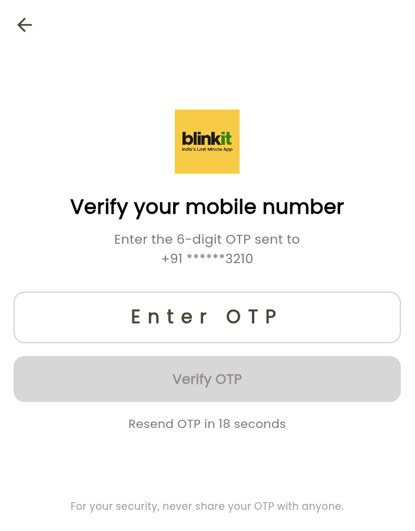
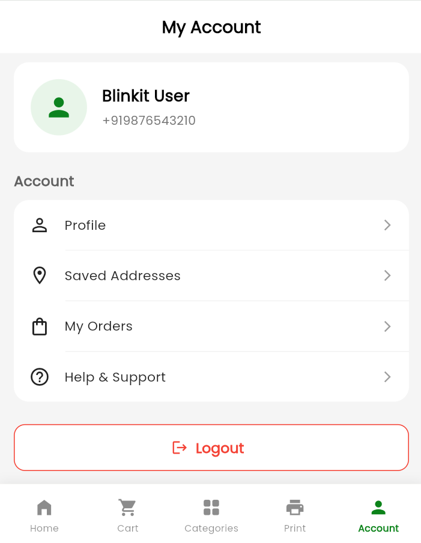

 # 📱 Blinkit Clone – Flutter Grocery Delivery App

A responsive **Blinkit-inspired grocery & quick-commerce application** built with Flutter and Firebase. The project features Firebase Phone Authentication with OTP verification, persistent login sessions, recruiter-friendly demo authentication, responsive product browsing, cart UI, category browsing, a Print Store, account management, and secure logout functionality.

The application is designed to work across **Android and Web**, with responsive layouts for mobile, tablet, laptop, and desktop screen sizes.

---

## 📱 Project Overview

This project is a **Flutter-based Blinkit UI clone** created to demonstrate practical mobile and web application development concepts.

The project demonstrates:

- Firebase Phone Authentication
- OTP-based user verification
- Firebase authentication session persistence
- Demo authentication for recruiter testing
- Platform-specific authentication handling for Android and Web
- Responsive UI for mobile, tablet, laptop, and desktop
- Multi-screen navigation with state preservation
- Account management and secure logout
 - Real-world e-commerce UI patterns 

---

## ✨ Features

| Feature | Description |
|---------|-------------|
| 🔐 **Splash Screen** | Branded splash screen that checks the Firebase authentication state before deciding whether to open Login or Home |
| 📱 **Phone Number Login** | Indian mobile-number login with `+91` country code and 10-digit number validation |
| 🔢 **OTP Verification** | Dedicated OTP screen with 6-digit validation, verification loading state, error handling, and resend timer |
| 🔥 **Firebase Authentication** | Phone authentication powered by Firebase Authentication |
| 🌐 **Android & Web Authentication** | Platform-specific Firebase phone authentication flow for Android and Flutter Web |
| 🧪 **Demo Login** | Firebase test phone number and fixed OTP support for recruiter/portfolio demonstrations without sending real SMS |
| 💾 **Persistent Login** | Firebase authentication session is retained after restarting or reopening the application |
| 🏠 **Home Screen** | Blinkit-inspired header with delivery ETA, address, search bar, promotional banner, horizontal categories, and product grids |
| 📂 **Category Screen** | Multiple product sections including Groceries & Kitchen, Snacks & Drinks, and Household Essentials |
| 🛒 **Cart Screen** | Cart-style interface with reorder section and Bestsellers containing product details, delivery time, and prices |
| 🖨️ **Print Store** | Document printing service UI with pricing, paper quality, print type, and Upload Files CTA |
| 👤 **Account Screen** | Displays authenticated user's phone number along with Profile, Saved Addresses, My Orders, and Help & Support options |
| 🚪 **Secure Logout** | Firebase `signOut()` clears the authenticated session and returns the user to Login while removing previous routes |
| 🧭 **Bottom Navigation** | 5-tab navigation: **Home · Cart · Categories · Print · Account** with `IndexedStack` for state preservation |
| ⬅️ **Smart Back Handling** | Custom back-navigation behaviour prevents unwanted navigation and maintains a smooth tab experience |
| 📐 **Responsive Design** | Responsive layouts optimized for mobile, tablet, laptop, and desktop screen sizes |
 
---

## 🔐 Authentication Flow

The application uses **Firebase Authentication** for phone-number authentication.

### Android

```text
Phone Number
     ↓
verifyPhoneNumber()
     ↓
Verification ID
     ↓
OTP Screen
     ↓
PhoneAuthCredential
     ↓
signInWithCredential()
     ↓
Authenticated User
```

### Web

```text
Phone Number
     ↓
signInWithPhoneNumber()
     ↓
Firebase Web Verification / reCAPTCHA
     ↓
ConfirmationResult
     ↓
OTP Screen
     ↓
confirmationResult.confirm(OTP)
     ↓
Authenticated User
```

After successful authentication, Firebase maintains the user's session. When the application starts again, the Splash Screen checks:

```dart
FirebaseAuth.instance.currentUser
```

If a user is already authenticated, the application directly opens the main application instead of asking them to log in again.

---
 
## 🛠️ Tech Stack

| Technology | Purpose |
|------------|---------|
| **Flutter** | Cross-platform application framework |
| **Dart** | Programming language |
| **Firebase Core** | Firebase initialization and configuration |
| **Firebase Authentication** | Phone-number authentication and OTP verification |
| **Firebase Hosting** | Deployment of the Flutter Web application |
| **FlutterFire CLI** | Firebase configuration for Flutter platforms |
| **Material Design** | UI components and application styling |
| **IndexedStack** | Bottom-navigation screen switching while preserving state |
| **PopScope** | Custom Android back-navigation handling |
| **Navigator** | Login, OTP, Home, and Logout navigation flows |
| **MediaQuery** | Screen-size detection for responsive layouts |
| **LayoutBuilder** | Constraint-based responsive UI |

---

## 📂 Folder Structure

```text
blinkit_app/
│
├── lib/
│   ├── main.dart
│   ├── firebase_options.dart
│   │
│   ├── domain/
│   │   └── constants/
│   │       └── appcolors.dart
│   │
│   └── repository/
│       │
│       ├── widgets/
│       │   └── uihelper.dart
│       │
│       └── screens/
│           │
│           ├── splash/
│           │   └── splashscreen.dart
│           │
│           ├── login/
│           │   ├── loginscreen.dart
│           │   └── otpscreen.dart
│           │
│           ├── home/
│           │   └── homescreen.dart
│           │
│           ├── category/
│           │   └── categoryscreen.dart
│           │
│           ├── cart/
│           │   └── cartscreen.dart
│           │
│           ├── print/
│           │   └── printscreen.dart
│           │
│           ├── account/
│           │   └── accountscreen.dart
│           │
│           └── bottomnav/
│               └── bottomnavscreen.dart
│
├── assets/
│   └── images/
│       └── App images, logos, icons & product assets
│
├── screenshots/
│   └── Project screenshots
│
├── android/
├── web/
├── pubspec.yaml
└── README.md
```

---

## 📸 Screenshots 

### Splash & Login Screen

<p align="center">
  
  
</p>

### OTP & Account Screen

<p align="center">
  
  
</p>

### Home & Cart Screen

<p align="center">
  
  
</p>

### Category & Print Screen

<p align="center">
  
  
</p>

---

## 🚀 Installation Steps

### 1️⃣ Prerequisites

Make sure you have:

- **Flutter SDK 3.x or newer**
- **Android Studio** or **VS Code**
- Flutter & Dart extensions
- Android emulator or physical Android device
- Chrome for Flutter Web testing
- A Firebase project

---

### 2️⃣ Clone the Repository

```bash
git clone https://github.com/Your_Username/Blinkit_Clone.git

cd Blinkit_Clone
```

---

### 3️⃣ Install Dependencies

```bash
flutter pub get
```

---

### 4️⃣ Firebase Configuration

The project uses Firebase Authentication.

If configuring your own Firebase project:

```bash
firebase login
```

Install/configure FlutterFire if required:

```bash
dart pub global activate flutterfire_cli
```

Then:

```bash
flutterfire configure
```

This generates:

```text
lib/firebase_options.dart
```

Enable:

```text
Firebase Console
→ Authentication
→ Sign-in method
→ Phone
→ Enable
```

For Web deployment, ensure your hosting domain is included under:

```text
Authentication
→ Settings
→ Authorized domains
```

---

### 5️⃣ Firebase Test Phone Number

For development or portfolio demonstration, configure a test phone number from Firebase Authentication.

```text
Firebase Console
→ Authentication
→ Sign-in method
→ Phone
→ Phone numbers for testing
```

Add a test phone number and fixed 6-digit verification code.

> Test credentials should only be used for development/demo purposes.

---

### 6️⃣ Configure Assets

Ensure `pubspec.yaml` contains:

```yaml
flutter:
  assets:
    - assets/images/
```

---

### 7️⃣ Run on Android

```bash
flutter run
```

Or select an Android emulator/physical device from VS Code and run the project.

---

### 8️⃣ Run on Chrome

```bash
flutter run -d chrome
```

---

### 9️⃣ Build Flutter Web

```bash
flutter build web
```

---

### 🔟 Deploy to Firebase Hosting

```bash
firebase deploy --only hosting
```

---

## 🔄 Complete User Journey

```text
Launch App
   ↓
Splash Screen
   ↓
Check Firebase User
   ↓
Login Required?
   │
   ├── No → Home
   │
   └── Yes
        ↓
   Phone Login
        ↓
   Send OTP
        ↓
   OTP Verification
        ↓
   Firebase Authentication
        ↓
   Home
        ↓
┌───────┬──────┬────────────┬───────┬─────────┐
Home   Cart   Categories   Print   Account
                                      ↓
                                    Logout
                                      ↓
                                    Login
```

---

## 🎨 Color Palette

| Element | Hex Code | Color | Usage |
|---------|----------|-------|-------|
| Header | `#F7CB45` | 🟡 Golden Yellow | Blinkit-style Home header |
| Primary Green | `#0C831F` | 🟢 Green | Authentication buttons and primary actions |
| ADD Button | `#27AF34` | 🟢 Green | Product ADD buttons |
| Search Border | `#C5C5C5` | Light Grey | Search/input field borders |
| Promotional Banner | `#E73837` → `#C62828` | 🔴 Red | Mega Diwali Sale banner |

--- 

## 👨‍💻 Author

| | |
|---|---|
| **Name** | `BHUPENDER` |
| **GitHub** | [](https://github.com/bhupender1208) |
| **LinkedIn** | [](https://www.linkedin.com/in/bhupender-00b134282/) |
| **Email** | [](mailto:bhupender00012@gmail.com) |

---

> 💡 **For Recruiters:** This project demonstrates practical Flutter development including responsive UI design, Firebase Phone Authentication, OTP verification, authentication persistence, Android/Web platform handling, reusable components, navigation, and Firebase integration.

---

<p align="center">
  <b>🚀 Built with Flutter & Firebase ❤️ | Responsive across Android & Web</b>
</p>
