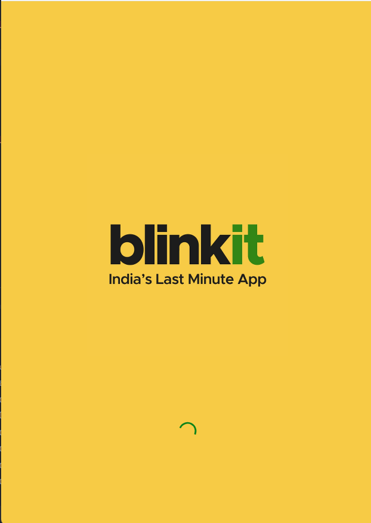
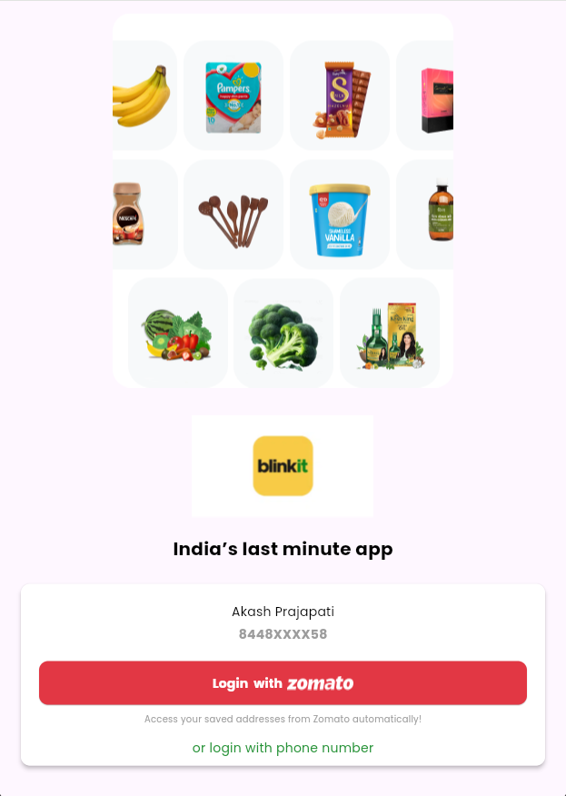
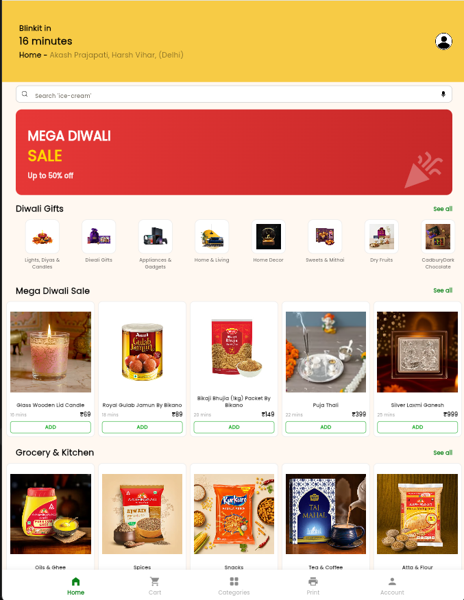
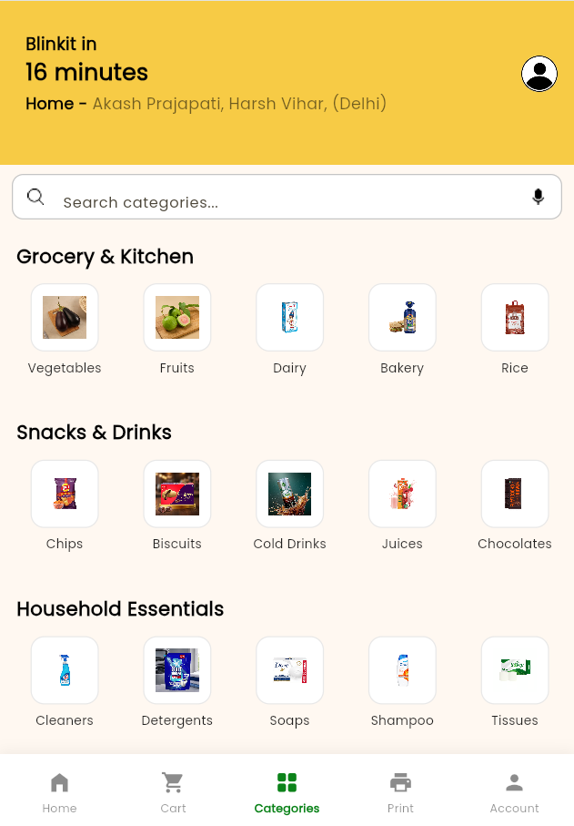
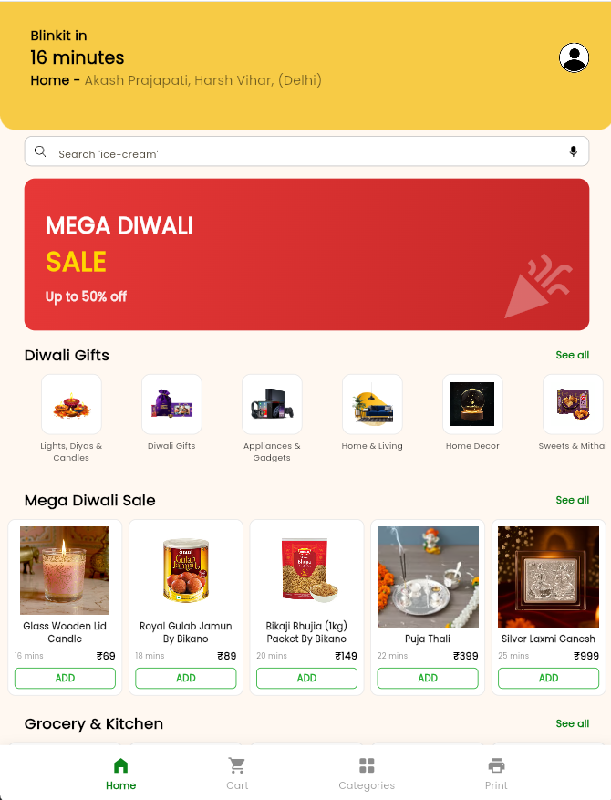
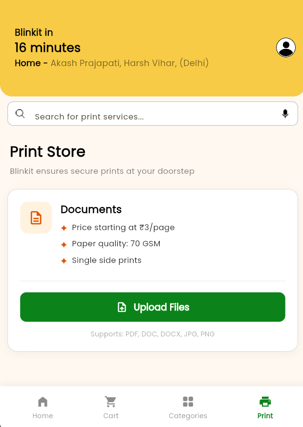

# 📱 Blinkit Clone – Flutter Grocery Delivery App

A complete **Blinkit-style grocery & food delivery app** built with Flutter. The app features a polished UI with a branded splash screen, phone-based login, multi-category product browsing, a shopping cart, and even a **Print Store** for document uploads — all tied together with a smooth bottom navigation experience.

---

## 📱 Project Overview

This is a **UI clone of the Blinkit app** (India's leading quick-commerce grocery delivery platform) developed entirely in Flutter. The project demonstrates:

- Multi-screen navigation with state preservation
- Reusable custom widget architecture (`Uihelper`)
- Centralized theme management (`Appcolors`)
- Real-world e-commerce UI patterns — banners, horizontal scrolls, product cards
- Clean separation of concerns across multiple Dart files

The app simulates a complete user journey: **Splash → Login → Home → Browse Categories → Add to Cart → Print Documents**.

---

## ✨ Features

| # | Feature | Description |
|---|---------|-------------|
| 🔐 | **Splash Screen** | Branded 3-second splash with centered app logo, auto-navigates to Login |
| 📲 | **Login Screen** | social media login icon, Log in or Signup button, and phone number login option |
| 🏠 | **Home Screen** | Golden Yellow-themed header with 16-min delivery ETA, user address bar, search field, "Mega Diwali Sale" promotional banner, and horizontally scrollable product categories |
| 📂 | **Category Screen** | Three sections — *Groceries & Kitchen*, *Snacks & Drinks*, *Household Essentials* — all with horizontal scrollable item lists |
| 🛒 | **Cart Screen** | Reorder prompt with empty-cart illustration, plus a **Bestsellers** section showing product images, names, delivery time, and pricing |
| 🖨️ | **Print Store** | Document printing service UI — price per page, paper quality details, single-sided print type, and "Upload Files" CTA button |
| 🧭 | **Bottom Navigation** | 4-tab bar: **Home · Cart · Categories · Print** using `IndexedStack` for state preservation |
| ⬅️ | **Smart Back Handling** | `PopScope` intercepts Android back button — exits only from Home tab, redirects to Home from other tabs |
| 🎨 | **Reusable UI Kit** | `Uihelper` class provides `CustomImage`, `CustomText`, `CustomTextField`, and `CustomButton` for DRY, consistent UI |
| 🎨 | **Centralized Colors** | `Appcolors` class with static color constants for easy theme-wide changes |

---

## 🛠️ Tech Stack

| Technology | Purpose |
|-------------|---------|
| **Flutter** | Cross-platform UI framework |
| **Dart** | Programming language |
| **Material Design** | UI component library & theming |
| **`IndexedStack`** | Multi-tab screen switching without losing widget state |
| **`PopScope`** | Android back button interception & custom handling |
| **`Navigator.pushReplacement`** | Seamless screen transitions (Splash → Login → Home) |
| **`Timer`** | Splash screen countdown delay logic |
| **Custom `Uihelper`** | Reusable widget factory — images, text, fields, buttons |

---

## 📂 Folder Structure

```
blinkit_clone/
├── lib/
│   ├── main.dart                    # App entry point → MaterialApp with theme & SplashScreen
│   ├── appcolors.dart               # Appcolors class — static color constants
│   ├── uihelper.dart                # Uihelper class — CustomImage, CustomText, CustomTextField, CustomButton
│   ├── splashscreen.dart            # 3-second splash → auto-navigate to LoginScreen
│   ├── loginscreen.dart             # Login UI with social & phone authentication options
│   ├── homescreen.dart              # Home screen with banner, search, & product categories
│   ├── categoryscreen.dart          # Category browsing (Groceries, Snacks & Drinks, Household)
│   ├── cartscreen.dart              # Cart screen with Reorder section & Bestsellers
│   ├── printscreen.dart             # Print Store — pricing card & document upload UI
│   └── bottomnavscreen.dart         # BottomNavigationBar controller (IndexedStack + PopScope)
├── assets/
│   └── images/                      # All app assets — logos, icons, product images, banners
├── pubspec.yaml                     # Flutter project config & asset declarations
└── README.md                        # ← You are here!
```

---

## 📸 Screenshots

| Screen | What to Capture |
|--------|-----------------|
| **Splash Screen** | Centered Blinkit logo on branded background |
| **Login Screen** | Onboarding screen, dual login buttons, login with google and login with phone number |
| **Home Screen** | Golden Yellow header, 16-min delivery badge, Diwali Sale banner, scrollable products |
| **Category Screen** | Grocery & Kitchen items in horizontal scroll list |
| **Cart Screen** | Bestsellers grid with product images, names, delivery time, and prices |
| **Print Store** | Document printing card with ₹3/page pricing + "Upload Files" button |
| **Bottom Navigation** | All 4 tabs (Home, Cart, Categories, Print) visible in the bar |

## Splash and Login Screen

<p align="center">
  
   
</p>

## Home and Category Screen

<p align="center">
  
  
</p>

## Cart and Print Screen

<p align="center">
  
  
</p>
 

---

## 🚀 Installation Steps

### 1️⃣ Prerequisites

- **Flutter SDK** ≥ 3.x → [Installation Guide](https://docs.flutter.dev/get-started/install)
- **Android Studio** or **VS Code** with Flutter & Dart extensions
- A physical device or emulator (**Android** / **iOS**)

### 2️⃣ Clone the Repository

```bash
git clone https://github.com/YOUR_USERNAME/blinkit-clone.git
cd blinkit-clone
```

### 3️⃣ Install Dependencies

```bash
flutter pub get
```

### 4️⃣ Configure Assets

Ensure your `pubspec.yaml` includes the assets directory:

```yaml
flutter:
  assets:
    - assets/images/
```

Add the required images to `assets/images/`:

| Image File | Used In |
|------------|---------|
| `onboarding.png` | Login Screen |
| `blinkit_logo.png` | Login Screen |
| Various product images | Home, Category, Cart screens |
| Cart illustration | Cart Screen |
| `search.png`, `mic.png` | Search bar icons |

### 5️⃣ Run the App

```bash
flutter run
```

The app will launch with: **Splash Screen → Login Screen → Bottom Navigation** flow.

---

## 🎨 Color Palette

| Constant | Hex Code | Color | Usage |
|----------|----------|-------|-------|
| `scaffoldbackground` | `#F7CB45` | 🟡 Golden Yellow | App-wide scaffold background |
| Search Border | `#C5C5C5` | ⬜ Light Grey | Search field border color |
| ADD Button | `#27AF34` | 🟢 Green | "ADD" call-to-action buttons |

---

## 👨‍💻 Author

| | |
|---|---|
| **Name** | `BHUPENDER` |
| **GitHub** | [](https://github.com/bhupender1208) |
| **LinkedIn** | [](https://www.linkedin.com/in/bhupender-00b134282/) |
| **Email** |[](mailto:bhupender00012@gmail.com) |


> 💡 *Tip for recruiters:* This project showcases **Flutter UI development**, **state management**, **navigation patterns**, **custom reusable widgets**, and **clean code architecture** — all essential skills for a Flutter developer role.

---

 

<p align="center">
  <b>🚀 Built with Flutter & ❤️ | Showcasing Flutter skills to the world!</b>
</p>

